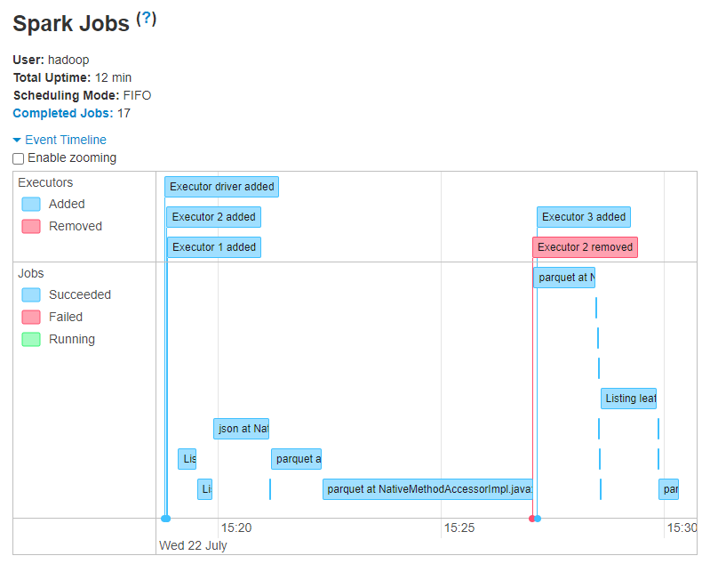
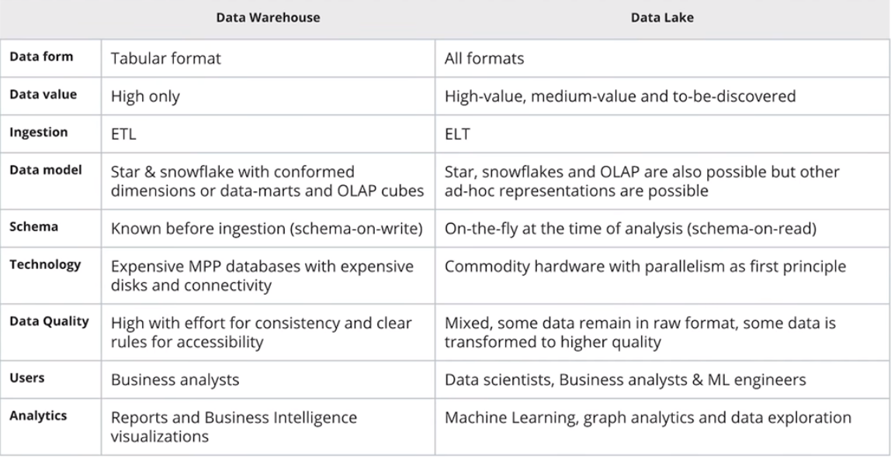
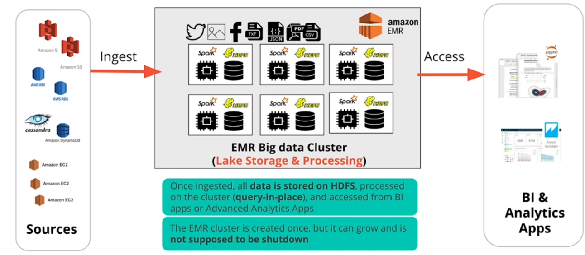
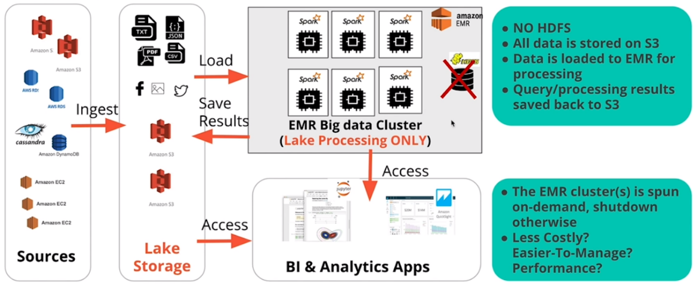
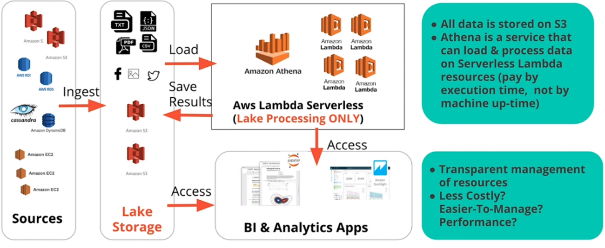

# Building a Data Lake in AWS
**Implementing a Data Lake in Amazon's cloud with AWS S3, AWS EMR and Spark.**

**Note:** Most of the contents in this project are based on [Udacity's Data Engineering Nanodegree Program](https://www.udacity.com/course/data-engineer-nanodegree--nd027),
if you aim to know more about databases, ETL on the cloud, and data pipelines, consider enrolling in it.

## Requirements
* Basic SQL and Python programming skills
* [Registered AWS account](https://portal.aws.amazon.com/billing/signup#/start)
* [AWS CLI 2.0](https://docs.aws.amazon.com/cli/latest/userguide/install-cliv2.html)

## Table of contents
- [Introduction](#introduction)
  * [What is this project about?](#what-is-this-project-about-)
  * [Project Datasets](#project-datasets)
- [Project Steps](#project-steps)
  * [Decide a schema for Song Play Analysis](#decide-a-schema-for-song-play-analysis)
  * [Create a IAM User for the API](#create-a-iam-user-for-the-api)
  * [Create an AWS S3 bucket](#create-an-aws-s3-bucket)
  * [Create an Amazon EC2 Key Pair](#create-an-amazon-ec2-key-pair)
  * [Choose a Data Lake architecture in AWS](#choose-a-data-lake-architecture-in-aws)
  * [Launch an EMR Cluster](#launch-an-emr-cluster)
  * [Run `etl.py` in the cluster](#run--etlpy--in-the-cluster)
  * [Understand your ETL pipeline](#understand-your-etl-pipeline)
  * [Analyze your ETL performance with Spark UI](#analyze-your-etl-performance-with-spark-ui)
  * [Clean Up Resources](#clean-up-resources)
- [FAQ](#faq)
  * [Isn't a Data Warehouse a better option than a Data Lake?](#isn-t-a-data-warehouse-a-better-option-than-a-data-lake-)
  * [Data Warehouse vs Data Lake](#data-warehouse-vs-data-lake)
  * [What is EMR?](#what-is-emr-)
  * [How much does EMR cost?](#how-much-does-emr-cost-)
  * [Why do you need EMR Cluster instead of deploying many EC2 units yourself?](#why-do-you-need-emr-cluster-instead-of-deploying-many-ec2-units-yourself-)
  * [What is an AWS S3 bucket?](#what-is-an-aws-s3-bucket-)
  * [Differences between HDFS and AWS S3](#differences-between-hdfs-and-aws-s3)
  * [Are there any other options for implementing a Data Lake in AWS?](#are-there-any-other-options-for-implementing-a-data-lake-in-aws-)

## Introduction

### What is this project about?
Imagine you have just been hired as data engineer by a music streaming startup called Sparkify. 
The company has grown their user base and song database to a an extent that they want to move their 
data warehouse to a data lake. Their gave you access to their data which consists in a directory of JSON logs
on user activity on the app, as well as a directory with JSON metadata on the songs in their app.

As their data engineer, you are tasked with uploading this data to S3 and building an ETL pipeline that extracts their
data from it, processes the data using Spark, and loads it back into S3 as a set of dimensional tables. This will allow their
analytics team to continue finding insights in what songs their users are listening to.

### Project Datasets
You can find all the zipped data in the [data folder](data). You might as well extract it to your working
directory as it will be required in a further step.   
 
#### Song Dataset
The first dataset is a subset of real data from the [Million Song Dataset](https://labrosa.ee.columbia.edu/millionsong/).
Each file is in JSON format and contains metadata about a song and the artist of that song.

These files are partitioned by the first three letters of each song's track ID.
For example, here are filepaths to two files in this dataset.
```
song_data/A/B/C/TRABCEI128F424C983.json
song_data/A/A/B/TRAABJL12903CDCF1A.json
```
And below is an example of what a single song file, TRAABJL12903CDCF1A.json, looks like.
```
{
    "num_songs": 1,
    "artist_id": "ARJIE2Y1187B994AB7",
    "artist_latitude": null,
    "artist_longitude": null,
    "artist_location": "",
    "artist_name": "Line Renaud",
    "song_id": "SOUPIRU12A6D4FA1E1",
    "title": "Der Kleine Dompfaff",
    "duration": 152.92036,
    "year": 0
}
```
#### Log Dataset

The second dataset consists of log files in JSON format generated by this [event simulator](https://github.com/Interana/eventsim)
based on the songs in the dataset above. These, simulate app activity logs from an imaginary music streaming app based on configuration settings.

The log files in the dataset you'll be working with are sorted by dates. For example, here are filepaths to two files in this dataset.
```
log_data/2018-11-12-events.json
log_data/2018-11-13-events.json
```
And below is an example of what the data in a log file, 2018-11-12-events.json, looks like.


## Project Steps
### Decide a schema for Song Play Analysis
In order to simplify queries and enable fast aggregations, we are going to use the **Star Schema** using the song and event datasets.
These tables will consist on:

**1 Fact Table**

* **songplays** - records in event data associated with song plays i.e. records with page NextSong
    * _songplay_id, start_time, user_id, level, song_id, artist_id, session_id, location, user_agent_

**4 Dimension Tables**

* **users** - users in the app
    * _user_id, first_name, last_name, gender, level_
* **songs** - songs in music database
    * _song_id, title, artist_id, year, duration_
* **artists** - artists in music database
    * _artist_id, name, location, lattitude, longitude_
* **time** - timestamps of records in songplays broken down into specific units
    * _start_time, hour, day, week, month, year, weekday_### Check scripts

When storing the tables back to S3, they will be in **parquet format, which will allow to use computations with a spark cluster allowing fast querying.**

### Create a IAM User for the API
First, create a new user with programmatic access logging to AWS-Console through your web browser at the IAM section.
You can follow the instructions [here](https://docs.aws.amazon.com/IAM/latest/UserGuide/id_users_create.html#id_users_create_console).

Pay attention to the Review section and copy down your new **access key ID** and **secret access key** at [dl.cfg](dl.cfg)
```
[IAM]
AWS_ACCESS_KEY_ID = AKIA33EAKPG3******** (change for yours)
AWS_SECRET_ACCESS_KEY = bYdxELjgshwbiBu8JWfsyGO3UFl94IFR******** (change for yours)
```
### Create an AWS S3 bucket
In this tutorial, you specify an AWS S3 bucket and folder to **retrieve** and **store** the data with an ETL process.
Because of Hadoop requirements, bucket and folder names that you use with Amazon EMR have the following limitations:

1. They must contain only letters, numbers, periods (.), and hyphens (-).
2. They cannot end in numbers.

If you already have access to a folder that meets these requirements, you can use it for this tutorial.
The output folder should be empty. Another requirement to remember is that bucket names must be unique across
all AWS accounts.

The bucket may exist in any region, but beware, the cluster that you will deploy should also be in that same region.
I recommend to use the default configuration for the whole creation process.

In this case, we called our bucket `mybucketfordatalaketutorial`, and included it in [dl.cfg](dl.cfg) as follows:
```
[IAM]
BUCKET_NAME=mybucketfordatalaketutorial (change for yours)
```
For more information about creating a bucket, see
[Create a Bucket](https://docs.aws.amazon.com/AmazonS3/latest/gsg/CreatingABucket.html) in the Amazon Simple Storage Service Getting Started Guide.
 
#### Upload your data to the bucket
By now you should have two different folders called `song-data` and `log-data`, which contain thousands of files.

If we use the browser in order to bulk-upload all of these, **the process may take more than 1 hour**, so we are going to
use AWS CLI instead.

Make sure your AWS CLI user has access rights to the bucket you just created, then, simply go to the directory in which you
extracted the zip files and use the following commands to get your data to S3 in **less than 8 minutes**.

```bash
aws s3 sync song-data s3://mybucketfordatalaketutorial/input/song-data
aws s3 sync log-data s3://mybucketfordatalaketutorial/input/log-data
```
In case you need help configuring AWS CLI 2.0, refer to [this tutorial](https://docs.aws.amazon.com/cli/latest/userguide/install-cliv2.html). 

### Create an Amazon EC2 Key Pair
You must have an Amazon Elastic Compute Cloud (Amazon EC2) key pair to connect to the nodes in your cluster over a
secure channel using the Secure Shell (SSH) protocol. If you already have a key pair that you want to use,
you can skip this step. If you don't have a key pair, follow one of the following procedures depending on your
operating system:
* [Creating Your Key Pair Using Amazon EC2](https://docs.aws.amazon.com/AWSEC2/latest/WindowsGuide/ec2-key-pairs.html#having-ec2-create-your-key-pair) in the Amazon EC2 User Guide for Windows Instances
* [Creating Your Key Pair Using Amazon EC2](https://docs.aws.amazon.com/AWSEC2/latest/UserGuide/ec2-key-pairs.html#having-ec2-create-your-key-pair) in the Amazon EC2 User Guide for Linux Instances. Use this procedure for Mac OS as well.

### Choose a Data Lake architecture in AWS
For this tutorial, we will go with an efficent and cheap solution, which consists on maintaining a cluster of spark workers
just when needed and storing all your raw and processed data to your S3 bucket. To learn more about it check
[AWS EMR (Spark only) data lake architecture](AWS-EMR-HDFS-Spark) in FAQ.

#### Overview of setting up a Spark Cluster
1. Amazon S3 will store the dataset.
2. We rent a cluster of machines, i.e., our Spark Cluster, and it is located in AWS data centers. We rent these using AWS service called Elastic Compute Cloud (EC2).
3. We log in from your local computer to this Spark Cluster.
4. Upon running our Spark code, the cluster will load the dataset from Amazon S3 into the cluster’s memory distributed across each machine in the cluster.
5. The cluster will save the results back again to S3.

### Launch an EMR Cluster

#### Cluster configuration
The following table describes the configuration of the cluster you need to launch.

| Console field       	| Value                                         	| Description                                                                                                                                                                                                                                                                                                                                                                                                                                                                                                                                                                                                                                                                                                                                                                                                                                              	|
|---------------------	|-------------------------------------------------------	|----------------------------------------------------------------------------------------------------------------------------------------------------------------------------------------------------------------------------------------------------------------------------------------------------------------------------------------------------------------------------------------------------------------------------------------------------------------------------------------------------------------------------------------------------------------------------------------------------------------------------------------------------------------------------------------------------------------------------------------------------------------------------------------------------------------------------------------------------------	|
| Cluster name        	| datalake-cluster                                            	| The cluster name is an optional, descriptive name for your cluster that does not need to be unique.                                                                                                                                                                                                                                                                                                                                                                                                                                                                                                                                                                                                                                                                                                                                                      	|
| Logging             	| Disable                                                	| When logging is enabled, Amazon EMR writes detailed log data to the Amazon S3 folder specified. Logging can only be enabled when you create the cluster and the setting can't be changed later. A default Amazon S3 bucket is specified. You can optionally specify your own. For more information, see View Log Files Archived to Amazon S3.                                                                                                                                                                                                                                                                                                                                                                                                                                                                                                            	|
| Launch mode         	| Cluster                                               	| This option specifies whether to launch a long-running cluster or a cluster that terminates after running any steps that you specify.<br>With the Cluster option, the cluster continues to run until you terminate it, which is called a long-running cluster. If you choose Step execution, Amazon EMR prompts you to add and configure steps. You can use steps to submit work to a cluster. After the steps that you specify finish executing, the cluster terminates automatically. For more information, see [Configuring a Cluster to Auto-Terminate or Continue](https://docs.aws.amazon.com/emr/latest/ManagementGuide/emr-plan-longrunning-transient.html).                                                                                                                                                                                                                                                                                   	|
| Release             	| emr-5.30.1                                            	| This option specifies the Amazon EMR release version to use when the cluster is created. The Amazon EMR release determines the version of open-source applications, such as Hadoop and Hive, that Amazon EMR installs. The label for the latest release version is selected by default. You can select an earlier Amazon EMR release if you need different versions of open-source applications for compatibility with your solution. Some Amazon EMR features and applications may not be available when using earlier Amazon EMR release versions, so recommend that you use the latest release version whenever possible. For more information about each Amazon EMR release version, see [Amazon EMR Release Guide](https://docs.aws.amazon.com/emr/latest/ReleaseGuide/).                                                                                                                                   	|
| Applications        	| Spark                                                    	| This option determines the open-source applications from the big data ecosystem to install on your cluster. The most common application combinations are available using quick start. To select your own combination of applications, including additional applications not listed in quick start, choose Go to advanced options. For information about the applications and versions available with each Amazon EMR release version, see [Amazon EMR Release Guide](https://docs.aws.amazon.com/emr/latest/ReleaseGuide/). <br>In addition, if an application isn't available for Amazon EMR to install, or you need to install a custom application on all cluster instances, you can use a bootstrap action. For more information, see [Create Bootstrap Actions to Install Additional Software](https://docs.aws.amazon.com/emr/latest/ManagementGuide/emr-plan-bootstrap.html). If you select Step execution, Amazon EMR chooses the applications to install based on what your steps require. 	|
| Instance type       	| m5.xlarge                                             	| This option determines the Amazon EC2 instance type that Amazon EMR initializes for the instances that run in your cluster. The default instance selection varies by region and some instance types may not be available in some regions. For more information, see [Configure Cluster Hardware and Networking](Configure Cluster Hardware and Networking.).                                                                                                                                                                                                                                                                                                                                                                                                                                                                                                                                           	|
| Number of instances 	| 3                                                     	| This option determines the number of Amazon EC2 instances to initialize. Each instance corresponds to a node in the Amazon EMR cluster. You must have at least one node, which is the master node. For guidance about choosing instance types and the number of instances, see [Cluster Configuration Guidelines and Best Practices](https://docs.aws.amazon.com/emr/latest/ManagementGuide/emr-plan-instances-guidelines.html).                                                                                                                                                                                                                                                                                                                                                                                                                                                                                                                      	|
| EC2 key pair        	| datalake********                                      	| This specifies the Amazon EC2 key pair to use when connecting to the nodes in your cluster over a Secure Shell (SSH) connection. It is strongly recommend that you create and specify an Amazon EC2 key pair. If you do not select a key pair, you cannot connect to the cluster to submit steps or interact with applications. For more information, see [Connect to the Cluster](https://docs.aws.amazon.com/emr/latest/ManagementGuide/emr-connect-master-node.html). To connect, you also need to create an inbound rule in the security group to allow SSH connections.                                                                                                                                                                                                                                                                                                                                                                       	|
| Permissions         	| Default                                               	| Use this option to specify the AWS Identity and Access Management roles that the cluster uses. These roles determine the permissions that Amazon EMR and the applications running on cluster instances have to interact with other AWS services. You can choose Custom to specify your own roles. We recommend using the default roles to start with. For more information, see [Configure IAM Service Roles for Amazon EMR Permissions to AWS Services and Resources](https://docs.aws.amazon.com/emr/latest/ManagementGuide/emr-iam-roles.html).                                                                                                                                                                                                                                                                                                                                                                                    	|
Here we called our cluster `datalake-cluster`, but you can choose any name you like.
 
Also, remember to use the key pair you created some steps before.
 
If you need help setting up the cluster, read the [getting started documentation](https://docs.aws.amazon.com/emr/latest/ManagementGuide/emr-gs.html)

#### Enable SSH access to your cluster with a Security Group
Security groups act as virtual firewalls to control inbound and outbound traffic to your cluster.
When you create your first cluster, Amazon EMR creates the default Amazon EMR-managed security group associated
with the master instance, `ElasticMapReduce-master`, and the security group associated with core and task nodes,
`ElasticMapReduce-slave`.

Using AWS web-interface, you must find the security group your `master` node is referring to and grant inbound access from
your IP at port 22.


### Run `etl.py` in the cluster
The cluster will take around 10 minutes to start. Once it is working, you must copy down your master node's public IP
(in my case `54.202.213.32`) and access it with the following ssh command.
```bash
ssh -i datalake********.pem hadoop@54.202.213.32
```
>**Note:** the .pem file is the key pair you created for this project, you must make sure that the access rights are
exclusive to your current user, otherwise, the connection will not work.

If you were able to access it, that's a big success, congratulations!

Now, open a new terminal and transfer files for this project with `scp` as below:  
```bash
scp -i datalaketutorial.pem etl.py hadoop@54.202.213.32:/home/hadoop
scp -i datalaketutorial.pem dl.cfg hadoop@54.202.213.32:/home/hadoop
```

Now, in the terminal where you accessed your EMR cluster, simply run:
```bash
spark-submit etl.py
```
### Understand your ETL pipeline
The script you just ran will take around 12 minutes to perform all the operations in it. Meanwhile, we will sum up how
our ETL pipeline works when running ``etl.py``:

1. We load all the parameters in `dl.cfg` including our AWS credentials and the name of the S3 bucket we just created.
2. A spark session is created in order for the cluster to receive tasks.
3. Data is read from the bucket at `s3://input/song-data` as a dataframe to work with, then it is transformed and stored back again in S3 as parquet.files
4. Same as above but with `s3://input/song-data`

As a result, the dimensional tables are ready in parquet format, which will allow faster computations in the cluster for querying big data.

### Analyze your ETL performance with Spark UI
You should be able to reach the Spark job history at the same cluster console in the AWS web interface. Another option is
to modify your security group's inbound rules, allowing access to ports 4040 or 8080 for your IP (these ports are those in
which Spark UI normally runs).

Once in the UI, you should be able to see how your EMR cluster ran your ETL script with spark in different nodes, just as in the image below:



### Clean Up Resources
Congratulations, you just deployed an ETL pipeline with Spark.
Remember to delete your S3 bucket and EMR cluster in order to avoid unexpected costs.

## FAQ
### Isn't a Data Warehouse a better option than a Data Lake?
The data lake shares the goals of the data warehouse of supporting business insights beyond the day to day transactional data handling.

In fact, it is a new form of a data warehouse that evolved to cope with:
1. The variety of data formats (.xml, .json, .txt, etc.) and unstructured data handling.
2. The agile and ad-hoc nature of data exploration activities needed by new roles like the data scientist.
3. The wide spectrum data transformation needed by advanced analytics like machine learning, graph analytics, and recommender systems.

Still, data warehousing is a rather **mature field** with lots of **tried-and-true technologies**, and is still extremely
relevant to this day. For many organizations, this would still be the best option depending the project requirements.

### Data Warehouse vs Data Lake
Here is a summary of the differences between both architectures.



### What is EMR?
Amazon EMR is a managed cluster platform that simplifies running big data frameworks, such as Apache Hadoop and Apache
Spark, on AWS to process and analyze vast amounts of data. By using these frameworks and related open-source projects,
such as Apache Hive and Apache Pig, you can process data for analytics purposes and business intelligence workloads.
Additionally, you can use Amazon EMR to transform and move large amounts of data into and out of other AWS data stores
and databases, such as Amazon Simple Storage Service (Amazon S3) 

Check the latest documentation on the topic at [What Is Amazon EMR?](https://docs.aws.amazon.com/emr/latest/ManagementGuide/emr-overview.html).

### How much does EMR cost?
Prices are quite cheap, varying from 0.05$ an hour to 1$ depending on the configuration.

Check the latest documentation on the topic at [Amazon EMR pricing](https://aws.amazon.com/emr/pricing/?nc1=h_ls).

### Why do you need EMR Cluster instead of deploying many EC2 units yourself?
Since a Spark cluster includes multiple machines, in order to use Spark code on each machine,
we would need to download and install Spark and its dependencies. This is a manual process.
Elastic Map Reduce is a service offered by AWS that negates the need for you, the user,
to go through the manual process of installing Spark and its dependencies for each machine.

Also, here is a list of differences between these 2 services:

|                            	| AWS EMR                                                                                                                    	| AWS EC2                                                              	|
|----------------------------	|----------------------------------------------------------------------------------------------------------------------------	|----------------------------------------------------------------------	|
| Distributed computing      	| Yes                                                                                                                        	| Yes                                                                  	|
| Node categorization        	| Categorizes secondary nodes into core and task nodes as a result of which data can be lost in case a data node is removed. 	| Does not use node categorization                                     	|
| Can support HDFS?          	| Yes                                                                                                                        	| Only if you configure HDFS on EC2 yourself using multi-step process. 	|
| What protocol can be used? 	| Uses S3 protocol over AWS S3, which is faster than s3a protocol                                                            	| ECS uses s3a                                                         	|
| Comparison cost            	| Bit higher                                                                                                                 	| Lower      

### What is an AWS S3 bucket?
Amazon Simple Storage Service (S3) is distributed storage service designed to make web-scale computing easier for developers.

S3 has a simple web services interface that you can use to store and retrieve any amount of data, at any time,
from anywhere on the web. It gives any developer access to the same highly scalable, reliable, fast, inexpensive data
storage infrastructure that Amazon uses to run its own global network of web sites. The service aims to maximize
benefits of scale and to pass those benefits on to developers.

Check the latest documentation on the topic at [What is Amazon S3?](https://docs.aws.amazon.com/AmazonS3/latest/dev/Welcome.html).

### Differences between HDFS and AWS S3
Since Spark does not have its own distributed storage system, it leverages using HDFS or AWS S3, or any other distributed storage. In this tutorial we used AWS S3, but let’s review the advantages of using HDFS over AWS S3. 

* **AWS S3** is an **object storage system** that stores the data using key value pairs, namely bucket and key,
and **HDFS** is an **actual distributed file system** which guarantees fault tolerance. HDFS achieves fault tolerance
by having duplicate factors, which means it will duplicate the same files at 3 different nodes across the cluster
by default (it can be configured to different numbers of duplication).

* **HDFS** has usually been **installed in on-premise systems**, and traditionally have had engineers on-site
to maintain and troubleshoot Hadoop Ecosystem, which **cost more than having data on cloud.** Due to the **flexibility
of location** and **reduced cost of maintenance**, cloud solutions have been more popular. With extensive services you
can use within AWS, S3 has been a more popular choice than HDFS.

* Since AWS S3 is a **binary object store**, it can **store all kinds of format**, even images and videos.
HDFS will strictly require a certain file format - the popular choices are **avro** and **parquet**, which
have relatively high compression rate and which makes it useful to store large dataset.

### Are there any other options for implementing a Data Lake in AWS?
Yes, there are several options to deploy your Data lake in AWS:

| Storage 	| Processing 	| AWS-Managed Solutions 	| Vendor-Managed               	|
|---------	|------------	|-----------------------	|------------------------------	|
| HDFS    	| Spark      	| [AWS EMR (HDFS+Spark)](#AWS-EMR-(HDFS+Spark))  	| EC2 + Vendor Solution        	|
| S3      	| Spark      	| [AWS EMR (Spark Only)](#AWS-EMR-(Spark-Only))  	| EC2 + Vendor Solution        	|
| S3      	| Serverless 	| [AWS Athena](#AWS-Athena)            	| Serverless + Vendor Solution 	|

#### AWS EMR (HDFS+Spark)
* Costly, machines must be always up to not loose information.



#### AWS EMR (Spark Only)
* Potentially less costly.
* Less performance, due to load and save results to S3, but lately this is getting better.
* Your data is securely stored in AWS S3.



#### AWS Athena
* Function as a service (FaaS)
* Pay for execution time


